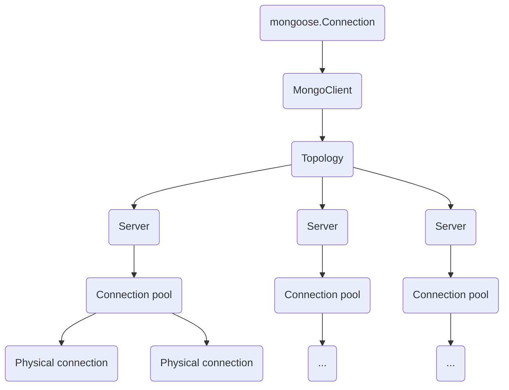

# What

This project aims to show that, in terms of MongoDB connections,
there's no difference between creating new mongoose connection
vs using single mongoose connection with connection pool

# Why does it matter?

This all means the it's OK to use a single `mongoose.Connection` instance
for the whole app. Just don't forget to call `mongoose.disconnect()` when you're
done

# Mongoose versions

The project was tested with `mongoose@6.11.1`. Maybe something has
changed since then

# Inspecting code

## Mongoose connection

Mongoose connection does not correspond to a single MongoDB connection.
Mongoose connection is an abstraction. 

By inspecting source code, we can see that

- `mongoose.connect()` calls `mongoose.Connection.openUri()`. It reuses the default
mongoose connection stored in `mongoose.connection` https://github.com/Automattic/mongoose/blob/ecb0249545670678c3d215f31bc0f2f85280559f/lib/index.js#L406

- `mongoose.createConnection()` creates new `Connection` instance. https://github.com/Automattic/mongoose/blob/ecb0249545670678c3d215f31bc0f2f85280559f/lib/index.js#L339

- mongoose interacts with MongoDB using `MongoClient` instance. Each `mongoose.Connection`
has `getClient()` method that returns its `MongoClient` https://github.com/Automattic/mongoose/blob/ecb0249545670678c3d215f31bc0f2f85280559f/lib/connection.js#L1503

- Eventually, `openUri()` is called on every connection. That's because you usually
pass `uri` to `connect()` or `createConnection()`, and those call `openUri()`
under the hood (see the first two links above)

- `mongoose.Connection.openUri()` calls `_createMongoClient()` https://github.com/Automattic/mongoose/blob/ecb0249545670678c3d215f31bc0f2f85280559f/lib/connection.js#L742

- `_createMongoClient()` creates instance of `mongodb.MongoClient` https://github.com/Automattic/mongoose/blob/ecb0249545670678c3d215f31bc0f2f85280559f/lib/connection.js#L887, and sets it
to `mongoose.Connection.client` property https://github.com/Automattic/mongoose/blob/ecb0249545670678c3d215f31bc0f2f85280559f/lib/connection.js#L892.  \
\
Recall that this property is returned from `mongoose.Connection.getClient()`

So know we know that each `mongoose.Connection` instance corresponds to
a single `mongodb.MongoClient` instance

## MongoClient

`mongoose@6.11.1` uses `mongodb@4.16.0` ([see package.json](https://github.com/Automattic/mongoose/blob/6.11.1/package.json#L24))

We will next inspect the code of mongodb 4.16.0

`MongoClient` has `connect()` method. It does actual connecting to
the DB https://github.com/mongodb/node-mongodb-native/blob/v4.16.0/src/mongo_client.ts#L444

It first collects the names of all server hosts, and then creates `Topology` 
instance from it https://github.com/mongodb/node-mongodb-native/blob/v4.16.0/src/mongo_client.ts#L464

[From the description of Topology class](https://github.com/mongodb/node-mongodb-native/blob/ccf555d069f3bd0eb7e7b2cca0d5ecdc7d571332/src/sdam/topology.ts#L183):

> A container of server instances representing a connection to a MongoDB topology.

My guess it that you can think of Topology as a single logical MongoDB database.
It can actually consist of multiple servers hosting multiple instances of the
database, synchronized with each other (e.g. replicated database for reliability)

While the guess might be inaccurate, `MongoClient` has a single `Topology`, 
and a `Topology` has multiple `Server` instances

## Topology

Why does a `Topology` has many `Server` instances? `Topology.connect()`
uses hosts information passed into Topology's constructor to call
`createAndConnectServer()` many times

https://github.com/mongodb/node-mongodb-native/blob/ccf555d069f3bd0eb7e7b2cca0d5ecdc7d571332/src/sdam/topology.ts#LL421C9-L421C31

`createAndConnectServer()` creates `new Server()` and calls `server.connect()`

https://github.com/mongodb/node-mongodb-native/blob/ccf555d069f3bd0eb7e7b2cca0d5ecdc7d571332/src/sdam/topology.ts#L760

## Server

`Server` instance is used to communicate to a single server into the topology.
This class has `command()` method that (finally) actually executes the
MongoDB command

As it turns out, each `Server` has its own `ConnectionPool` ([created in 
the constructor](https://github.com/mongodb/node-mongodb-native/blob/v4.16.0/src/sdam/server.ts#L154))

`command()` method uses `ConnectionPool.withConnection()` to pick a free connection and
execute the commands

https://github.com/mongodb/node-mongodb-native/blob/v4.16.0/src/sdam/server.ts#L347

## ConnectionPool

`withConnection()` has pretty clear comment describing it:

> Runs a lambda with an implicitly checked out connection, checking that connection back in when the lambda
> has completed by calling back.

'Checking out' means obtaining a free connection. `withConnection()` calls
`checkOut()` https://github.com/mongodb/node-mongodb-native/blob/v4.16.0/src/cmap/connection_pool.ts#L562

`checkOut()` enqueues the request into `this[kWaitQueue]` https://github.com/mongodb/node-mongodb-native/blob/v4.16.0/src/cmap/connection_pool.ts#L562

That queue is processed by `processWaitQueue()`, which calls 
`createConnection()` 

https://github.com/mongodb/node-mongodb-native/blob/v4.16.0/src/cmap/connection_pool.ts#L804

`createConnection()` calls `connect()` https://github.com/mongodb/node-mongodb-native/blob/v4.16.0/src/cmap/connection_pool.ts#L628

`connect()` calls `makeConnection()` https://github.com/mongodb/node-mongodb-native/blob/v4.16.0/src/cmap/connect.ts#LL53C10-L53C10

Finally, `makeConnection()` calls Node.js built-in `net.createConnection()`
that creates a physical socket connection to the DB

https://github.com/mongodb/node-mongodb-native/blob/v4.16.0/src/cmap/connect.ts#L399

## Summary 

To summarize, we have the following relationships between objects:

- `mongoose.Connection` has one `MongoClient`
- `MongoClient` has one `Topology`
- `Topology` has many `Server`s
- Each `Server` has its own `ConnectionPool`
- `ConnectionPool` contains multiple physical connections to the DB

(a mermaid diagram)

# Experiments

To experimentally verify that `mongoose.Connection` opens multiple
physical connections, you can run the various functions in `main.ts` 
and monitor the connections the your MongoDB instance

To see the mongo connections..

- On macOS/Linux: you can use `pnpm connections` or `npm run connections` command.
It runs the `connections.sh` script

- On Windows: you can connect the DB with `mongosh users` and periodically
run `db.serverStatus().connections` command as described [here](https://stackoverflow.com/a/8975876/12983861)

Last time I tested, mongoose opened `poolSize + 2` MongoDB connections for each mongoose connection

Comments at the beginning of each function explain how many connections you should see
